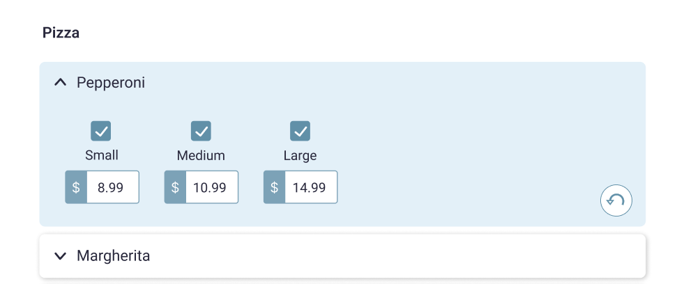

## Getting Started

1. Clone the repository: `git clone https://github.com/steliosal/fts-public-a.git`
2. Navigate to directory: `cd fts-public-a/pizza-menu`
3. Install the necessary dependencies: `npm install`
4. Start the development server: `npm run dev`

## Prerequisites
Before you begin, ensure you have met the following requirements:

- **Node.js**: This project requires a relatively recent version of Node.js, version 14 or higher. There are two recommended ways to install or update Node.js on your machine:

  1. **Direct Installation**: You can download and install Node.js directly from the [Node.js official website](https://nodejs.org/). Ensure you select a version that is 14 or higher.
  
  2. **Using Node Version Manager (nvm)**: For managing multiple Node.js versions on your machine, it is recommended to use Node Version Manager (nvm). This is especially useful if you are working on multiple projects that require different versions of Node.js. You can find installation instructions and usage details for `nvm` [here](https://github.com/nvm-sh/nvm). Once `nvm` is installed, you can install Node.js version 14 by running:
  
     ```sh
     nvm install 14
     nvm use 14
     ```

- **Supported Browsers**: The project has been tested and is known to work on the following browsers:
  - Google Chrome
  - Mozilla Firefox
  - Microsoft Edge

# Description

The following design:

depicts a part of an online ordering menu.

- Imagine a Pizza menu category that has a few items, and each item has sizes and prices for each size.
- Each item card on the design works like a bootstrap accordion (see https://getbootstrap.com/docs/5.0/components/accordion/)
- When you click on the item name the size/price section expands. At the same time the other item cards collapse.
- When you uncheck a size, the related price is set to 0.00, and the input above is disabled
- User can edit the price (only numbers are allowed).
- Price changes **persist after page refresh**
- Each item card has an "Undo" button/function, which is **only displayed** if the user has made any changes to item since the app initialized.
- When clicked, the selected item's state reverts to the initial one (what we had when the page first loaded)

Given the data and their models:
[data.ts](./data.ts)

1. Fork this repository on your account
2. Build a web app that matches the above design and functionality described above, using the available data
3. Send us the forked repo with your changes when you are ready

## Notes

1. You can use any CSS framework/library (e.g. `Bootstrap`) and icons for your implementation **(bonus points if you write your own CSS)**. Try to match the design as much as possible
2. You can use any of the recent Angular versions (at least v14+)
3. You can import or copy the data from `data.ts` file any way you want
4. You can use any of the available browser features/APIs to persist data between page reloads
5. The relations between the data use a classic relational approach (id based)
6. The undo function is performed **per item** and should work for _any item list length_
7. Try to use best coding practices as you would always do
